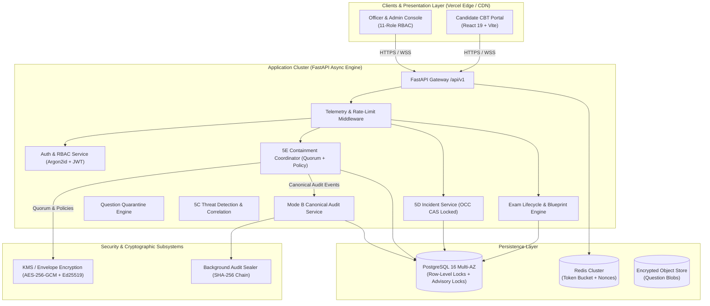

# Bharat Secure Examination Architecture (B-SEA)

> **Protect the Question. Protect the Examination. Protect Every Candidate.**  
> *A high-assurance, zero-trust security architecture and reference demonstration platform for national-scale examinations.*

[](tests/security/test_phase3c5e_containment.py)
[](tests/security/test_phase3c5d_service_correlation.py)
[](frontend/)
[](backend/)
[](https://neet-exam-defense-system.vercel.app)
[](https://neet-exam-defense-system.vercel.app)

> 🌐 **Official Live Production Deployment**: [https://neet-exam-defense-system.vercel.app](https://neet-exam-defense-system.vercel.app)  
> *Continuous Deployment is active. Every commit pushed to main automatically triggers an automated zero-downtime production deployment on Vercel.*

---

## 🎯 Executive Summary & Core Principle

High-stakes public and competitive examinations (such as medical, engineering, and civic recruitment) require non-negotiable confidentiality, integrity, and operational resilience across the entire examination lifecycle—from question authoring to controlled threshold release and computer-based test (CBT) delivery.

Traditional examination delivery systems rely excessively on physical custody and trusted individuals, introducing systemic vulnerabilities and single points of compromise.

**The B-SEA Zero-Trust Invariant:**
> *"No single person, account, server, examination centre, administrator, or compromised component should possess sufficient authority or cryptographic keys to obtain the complete examination paper prior to authorized release."*

---

## 🚀 What We Implemented in This Project

Across this project, the architecture was engineered and verified across five deep engineering phases, culminating in an end-to-end cloud-native system:

### 1. Phase 3C-4A & 4B: PostgreSQL 16 Concurrency Foundation
- **Decoupled Relational Foundation**: Native multi-tenant schema with high-concurrency connection pools (`asyncpg`).
- **Row-Level & Advisory Locks**: Prevented race conditions during concurrent candidate check-ins and exam state changes.
- **Tamper-Evident SHA-256 Audit Hash Chains**: Mode B cryptographically sealed audit blocks, verified by background sealer workers with PostgreSQL advisory locks.

### 2. Phase 3C-5A: Question Paper Quarantine & Moderation Lifecycle
- **Cryptographic Object Isolation**: Questions are stored as isolated encrypted objects rather than monolithic document files.
- **Automated Quarantine Engine**: Suspicious or flagged question forms are placed in cryptographic quarantine, preventing unauthorized compilation or release without dual-attestation unlock.

### 3. Phase 3C-5B: Enterprise Observability & Telemetry Middleware
- **Structured Telemetry Middleware**: `BSEAHttpTelemetryMiddleware` with OpenTelemetry/CloudWatch export.
- **Real-Time Latency Histograms**: Bounded latency measurements across auth, question decryption, and candidate heartbeat routes.
- **Layered Rate Limiting**: Endpoint-specific token-bucket rate limiters protecting against brute-force and scraping attacks.

### 4. Phase 3C-5C: Threat Detection & CloudTrail Correlation
- **5C Detection Rules**: Automated correlation engine identifying multi-vector attack signatures (credential stuffing, bulk extraction, timing anomalies, concurrent sessions).
- **Security Console**: Real-time alarm streaming, anomaly scoring, and automated alert triage.

### 5. Phase 3C-5D: Human-in-the-Loop Incident Management (Rev-06)
- **Authoritative 7-State Lifecycle**:  
  $$\text{TRIAGE} \longrightarrow \text{INVESTIGATING} \longrightarrow \text{CONTAINED} \longrightarrow \text{RESOLVED} \longrightarrow \text{CLOSED}$$  
  *(with `FALSE_POSITIVE` and `DUPLICATE` branches, and direct `REOPEN` to `INVESTIGATING`)*.
- **Optimistic Concurrency Control (OCC)**: Version-based CAS lock (`version` column checking) preventing concurrent overwrite conflicts between security responders.
- **Append-Only Forensic Notes**: Tamper-proof analyst investigation timeline with rolling 1-hour generation windows.

### 6. Phase 3C-5E: Policy-Governed Security Containment (Rev-04.1)
- **Dual Policy Evaluation Pipelines**:
  - *Standard Pipeline*: Evaluates risk, scope, and target state (`ALLOW`, `REQUIRE_SECOND_AUTHORIZER`, `DENY`).
  - *Emergency Break-Glass Pipeline*: Strictly prohibits `CRITICAL` targets, enforces 15-minute token TTL, 60-second atomic lease, and strict rate limits (2/hour per admin, 5/exam total).
- **RFC 8785 JSON Canonicalization (JCS)**: Deterministic hashing for `IntentKey` (requester-independent), `RequestKey`, `ScopeHash`, `TargetSnapshotHash`, and SHA-256 `ExternalOperationID`.
- **Two-Person Quorum Authorization**: Anti-self-approval enforcement with single-use cryptographic authorization nonces.
- **Subsystem Execution Adapters**: Automated revocation adapters for:
  - Candidate Examination Sessions
  - User Accounts & Staff Credentials
  - Question Items & Question Papers
  - Exam Forms & Blueprints
  - Examination Centres
  - Master Cryptographic Keys
- **Independent Out-of-Band State Verifier**: Direct database verifier confirming execution outcomes (`VERIFICATION_VERIFIED`, `VERIFICATION_FAILED`, `VERIFICATION_INCONCLUSIVE`).

### 7. Modern Civic UI/UX Redesign & Candidate CBT Experience
- **Calm, Human-Centered Design Language**: Original, anxiety-reducing visual system inspired by warmth, dignity, and civic trust.
- **Truthful Telemetry**: Every statistic, badge, and card binds directly to real FastAPI endpoints—zero fabricated metrics.
- **Candidate CBT Portal**: Admit-card verification, calm countdown timers, 5-state question palette, dynamic session watermark, answer autosave, and tamper-evident cryptographic submission receipt.
- **Comprehensive Administrative & Security Consoles**: Incident management with CAS conflict warnings, Containment console with two-person approval drawers, and immutable audit block viewer.

### 8. Production Vercel Deployment & SPA Routing
- **Vercel SPA Rewrites**: Catch-all client-side routing (`frontend/vercel.json` & `vercel.json`).
- **Strict Security Headers**: HSTS, `X-Frame-Options: DENY`, `X-Content-Type-Options: nosniff`, and restrictive `Permissions-Policy`.
- **Dynamic API Environment Binding**: `VITE_API_URL` configuration with clean fallback to `/api/v1`.
- **Restricted Production CORS**: Backend CORS origins dynamically restricted to authorized production domains.

---

## 🏛️ System Architecture



---

## 👥 11-Role Role-Based Access Control (RBAC)

B-SEA enforces strict operational separation of duties across 11 canonical roles:

| Role | Operational Scope & Responsibilities |
| :--- | :--- |
| `SUPER_ADMIN` | Platform configuration, emergency break-glass, tenant provisioning. Cannot view plaintext questions. |
| `SECURITY_OFFICER` | Alarm monitoring, threat hunting, containment initiation, and 5D incident investigation. |
| `EXAM_ADMIN` | Exam lifecycle management, blueprint authoring, centre allocation, and form scheduling. |
| `QUESTION_SETTER` | Drafts and cryptographically signs individual question objects. Cannot view other setters' items. |
| `MODERATOR` | Reviews, validates, and approves question items. Cannot compile full exam papers. |
| `CENTRE_SUPERINTENDENT` | Centre readiness verification, invigilator assignments, and local hardware checks. |
| `PROCTOR` | Real-time candidate monitoring, anomaly reporting, and local candidate check-in. |
| `RELEASE_AUTHORITY` | Holds Shamir/quorum threshold approval share for time-locked exam key release. |
| `AUDITOR` | Read-only inspection of immutable audit hash chains, sealer proofs, and compliance ledgers. |
| `CANDIDATE` | Authenticates via admit card, takes CBT exam with live watermarking, receives digital submission receipt. |
| `EMERGENCY_OPERATOR` | Authorized secondary authorizer for critical containment actions and centre lockdowns. |

---

## 🧪 Comprehensive Verification & Gate Status

Every security invariant is validated through automated test gates:

```
================================================================================
TEST SUITE / GATE IDENTIFIER      DESCRIPTION                             STATUS
================================================================================
TC-GATE-01 to TC-GATE-05          RFC 8785 JCS Identity & Canonical Hash  PASSED
TC-GATE-06 to TC-GATE-08          Standard Policy Dual-Pipeline Decision  PASSED
TC-GATE-09 to TC-GATE-10          Emergency Break-Glass Severity Gates    PASSED
TC-GATE-11 to TC-GATE-13          Quorum Authorization & Anti-Self-Appr   PASSED
TC-GATE-14 to TC-GATE-18          Break-Glass 15m TTL, 60s Lease & Limits PASSED
TC-GATE-19 to TC-GATE-25          Subsystem Execution Adapters (All 6)    PASSED
TC-GATE-26 to TC-GATE-28          Idempotency, CAS Conflicts & Audit      PASSED
TC-GATE-29 to TC-GATE-32          Out-of-Band Verifier & Attestation      PASSED
TC-GATE-33 to TC-GATE-35          5D Model Drift & Boundary Invariance    PASSED
--------------------------------------------------------------------------------
Phase 3C-5E Containment Gates:    35 / 35 PASSED (100%)
Phase 3C-5D Incident Regression:  31 / 31 PASSED (100%)
Total Backend Test Suite:         306 Passed, 0 Failed, 5 Skipped
Vite Production Bundle Build:     Clean (664ms, 0 errors)
================================================================================
```

---

## ⚡ Quick Start: Running Locally

### 1. Prerequisites
- **Python**: 3.11 or higher
- **Node.js**: 20 LTS or 22 LTS
- **PostgreSQL**: 16 (or local Docker container)
- **Redis**: 7+ (optional, in-memory fallback enabled for local testing)

### 2. Backend Setup
```bash
cd backend
python -m venv venv
# Windows:
.\venv\Scripts\activate
# Linux/macOS:
source venv/bin/activate

pip install -r requirements.txt

# Run database migrations
alembic upgrade head

# Start FastAPI server
uvicorn app.main:app --reload --port 8000
```
API Documentation will be available at: [http://localhost:8000/docs](http://localhost:8000/docs)

### 3. Frontend Setup
```bash
cd frontend
npm install
npm run dev
```
Portal will be available at: [http://localhost:5173/](http://localhost:5173/)

### 4. Running Verification Test Suites
```bash
# Run Phase 3C-5E Containment Acceptance Gates (35 gates)
pytest tests/security/test_phase3c5e_containment.py -v

# Run Phase 3C-5D Incident Service & Database Foundation (31 gates)
pytest tests/security/test_phase3c5d_service_correlation.py tests/security/test_phase3c5d_database_foundation.py -v

# Run Full Security Suite
pytest tests/security/ -v
```

---

## 🌐 Deploying to Vercel (1-Click)

The frontend is fully configured for continuous deployment on Vercel:

1. Click **[Deploy to Vercel](https://vercel.com/new/clone?repository-url=https%3A%2F%2Fgithub.com%2FMadhavan23-byte%2Fneet-exam-defense-system&root-directory=frontend)**.
2. Select your imported GitHub repository: `Madhavan23-byte/neet-exam-defense-system`.
3. Set the Environment Variable:
   - `VITE_API_URL`: `https://your-backend-api-domain.com`
4. Click **Deploy**.

---

## 🔗 Links & Resources

- **GitHub Repository**: [https://github.com/Madhavan23-byte/neet-exam-defense-system](https://github.com/Madhavan23-byte/neet-exam-defense-system)
- **Architecture Documentation**: [`docs/BSEA_PHASE3C5E_ARCHITECTURE_REV04_1.md`](docs/BSEA_PHASE3C5E_ARCHITECTURE_REV04_1.md)
- **UI/UX Design Specification**: [`docs/BSEA_UI_UX_DESIGN_SPECIFICATION.md`](docs/BSEA_UI_UX_DESIGN_SPECIFICATION.md)
- **Platform VIP Demo Runbook**: [`docs/BSEA_PLATFORM_DEMO_RUNBOOK.md`](docs/BSEA_PLATFORM_DEMO_RUNBOOK.md)
- **Deployment & Verification Walkthrough**: [`walkthrough.md`](walkthrough.md)

---

## 📜 License & Compliance Notice

This project is an advanced secure examination architecture demonstrator designed for defense-in-depth evaluation and verification. It demonstrates technical compliance with zero-trust cryptographic models, verifiable audit trails, and multi-party quorum authorization.
