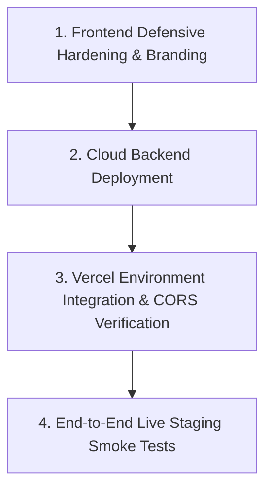

# B-SEA — Master Project State Document
**Document Classification:** Engineering Baseline & Takeover Audit  
**Date of Audit:** 2026-09-24  
**Audited Target:** `https://github.com/Madhavan23-byte/neet-exam-defense-system.git`  
**Working Directory:** `E:\Cloud-Mini-Project`  

---

## 1. Project Identity

- **Project Name:** B-SEA — Bharat Secure Examination Architecture
- **Purpose:** High-assurance, zero-trust examination hosting and examination-security platform designed for national-scale, high-stakes Computer-Based Testing (CBT) such as NEET, JEE, and civic recruitment.
- **Core Security Invariant:**
  > *"No single person, account, server, examination centre, administrator, or compromised component should possess sufficient authority or cryptographic keys to obtain the complete examination paper prior to authorized release."*
- **Platform Scope:** The system is an end-to-end examination platform with a security substrate beneath it. It covers question authoring, blind moderation, quarantine, cryptographic sealing, candidate admit cards, real-time CBT examination delivery, continuous session heartbeats, tamper-evident submission receipts, 11-role RBAC, threat detection (5C), human-in-the-loop incident response (5D), and policy-governed containment (5E).
- **Non-Goal:** It is not a cosmetic cybersecurity marketing dashboard or an AI-generated mock showcase.

---

## 2. Repository

- **Primary Source of Truth:** `https://github.com/Madhavan23-byte/neet-exam-defense-system.git`
- **Local Filesystem Location:** `E:\Cloud-Mini-Project`
- **Repository Structure:**
  - `backend/`: FastAPI application, modular security engines, SQLAlchemy models, Alembic migrations, test suites (`pytest`).
  - `frontend/`: React 19 + TypeScript + Vite 8.3 + Tailwind CSS application, administrative and candidate CBT interfaces.
  - `docs/`: Comprehensive architectural specifications, security audit records, performance baselines, and implementation runbooks.
  - `scripts/`: Operational utilities, seed scripts, performance benchmarking, and validation runners.
  - `terraform/`: Infrastructure-as-Code modules for staging on AWS (ALB, ECS, RDS, ElastiCache, KMS, CloudWatch, S3, Secrets Manager).
  - `docker/` & `docker-compose.yml`: Multi-container production-parity environment (PostgreSQL 16, Redis 7, MinIO, Backend, Frontend).
  - `.github/`: Continuous Integration workflows (`ci.yml`, `gh-pages.yml`).
  - `vercel.json` & `frontend/vercel.json`: Vercel Edge configuration, SPA rewrites, strict HTTP security headers.
  - `.env.example`: Configuration template for all deployment tiers.

---

## 3. Current Git State

- **Active Branch:** `main`
- **Upstream Tracking:** `origin/main` (up to date)
- **HEAD Commit:** `6996f19` — *docs: register official Vercel live production URL in documentation and README*
- **Working Tree Status:** Clean (`nothing to commit, working tree clean`)
- **Git Tags:** None registered
- **Recent Commit History:**
  - `6996f19` docs: register official Vercel live production URL in documentation and README
  - `3d0a682` ci(deploy): add automated GitHub Pages deployment workflow and Vite basename support
  - `7cf98ae` docs: update comprehensive project README with Phase 3C-4 to 5E, UI redesign, and deployment guides
  - `22f9b86` chore(deploy): configure Vercel SPA routing, secure CORS origins, and dynamic API base URL
  - `f85d208` feat(bsea): complete remaining security architecture implementation
  - `d8c2d62` chore(bsea): final independent security audit and project closure
  - `55f61d7` feat(bsea): complete remaining security architecture implementation
  - `7683dd6` feat: implement Phase 3C-5C detection correlation foundation
  - `d6d430f` fix(observability): forensic reconciliation of metric cardinality and CloudWatch filter patterns
  - `0ba5f5b` feat: implement Phase 3C-5B observability foundation

---

## 4. Frontend Architecture

- **Core Technologies:** React 19, TypeScript, Vite 8.3.0, Tailwind CSS.
- **Routing:** `react-router-dom` v6 with client-side SPA routing and protected route wrappers.
- **State Management:**
  - `authStore.ts` (Zustand): Persistent auth session (`bsea_token`, `bsea_user`), user profile, and role-based routing.
  - `examStore.ts` (Zustand): Candidate session store (watermark ID, countdown timer, question palette state, answers mapping, review flags, submission status).
- **Data Fetching:** `@tanstack/react-query` v5 and Axios with global interceptors (attaching `Authorization: Bearer <token>` and auto-redirecting on 401 Unauthorized).
- **Design System:** Institutional Civic Trust UI ("Gov Canvas" `#f8fafc`, Navy `#0f172a`, Amber accents, Emerald confirmation cues).
- **Component Breakdown:**
  - `components/ui/`: `PortalHeader`, `PortalFooter`, `GovBadge`, `MetricCard`, `Modal`.
  - `components/exam/`: `QuestionViewer`, `QuestionPalette`, `ExamTimer`, `WatermarkOverlay`, `ReviewModal`.
  - `components/security/`: `IncidentTimeline`, `ContainmentDrawer`, `AuditChainViewer`, `EventStream`.
  - `components/charts/`: Latency, request rate, and anomaly distribution charts via `recharts`.

---

## 5. Backend Architecture

- **Core Technologies:** Python 3.14.5, FastAPI (Async REST), Uvicorn / Gunicorn.
- **Application Structure:**
  - `app/main.py`: Application lifecycle (`lifespan`), CORS configuration, global rate limit exception handling, telemetry middleware, router mounting.
  - `app/core/`: `config.py` (Pydantic Settings), `database.py` (SQLAlchemy 2.0 async engine + connection pooling), `security.py` (Argon2id + JWT), `dependencies.py` (Rate limiters, DB session dependency), `telemetry_middleware.py`.
  - `app/api/v1/`: 13 specialized route controllers aggregated in `router.py`.
  - `app/modules/`: 19 domain modules separating business logic, state transitions, and security boundaries.
- **Observability Middleware:** `BSEAHttpTelemetryMiddleware` collects request-level duration, status codes, route categorization, and structured security metrics.
- **Rate Limiting:** `slowapi` token-bucket limiter with Redis distributed backend or memory fallback.

---

## 6. Database

- **Engine:** PostgreSQL 16 (production target and local Windows service `postgresql-x64-16`).
- **Connection Protocol:** `postgresql+asyncpg` for asynchronous runtime; `postgresql+psycopg2` for synchronous tooling and Alembic migrations.
- **Concurrency & Locking:** Row-level locks (`SELECT ... FOR UPDATE`), PostgreSQL advisory locks (`pg_try_advisory_lock`) to serialize audit sealing and background correlation daemons.
- **SQLite Fallback:** `bsea_demo.db` present in root contains 24 migrated relational tables for local developer evaluation without PostgreSQL.
- **Schema Management (Alembic):** 8 chronological migrations:
  1. `99c8ce339dd4`: Baseline schema v1 (Users, Orgs, Exams, Blueprints, Questions, Candidates, Sessions, Audit).
  2. `a2f3b4c5d6e7`: Add question assignments for blind sharding.
  3. `b3a1c2d3e4f5`: Add ephemeral question access grants.
  4. `c4b2d3e4f5a6`: Add break-glass request and multi-role approval models.
  5. `e5f6a7b8c9d0`: Phase 3C-4 decoupled audit foundation and epoch seals.
  6. `f1a2b3c4d5e6`: Phase 3C-5A poison quarantine mechanism.
  7. `a1b2c3d4e5f6`: Phase 3C-5D security incident management foundation (7-state model, OCC, forensic timeline).
  8. `b2c3d4e5f6a7`: Phase 3C-5E policy-governed containment foundation (Requests, Authorizations, Executions, Verifications).

---

## 7. Redis

- **Configured URI:** `redis://:bsea_redis_pass@localhost:6379/0`
- **Role:** Distributed rate limiting quotas, candidate active session tracking, heartbeat liveness cache, ephemeral token leases.
- **Local Status:** Windows host refused connection on port 6379 (Redis service is not running locally; runs in Docker Compose).
- **Resilience Behavior:** The codebase implements graceful degradation: candidate test sessions continue with local synchronization if Redis is offline, while high-risk administrative operations fail closed per Phase 3C-1 specifications.

---

## 8. Object Storage

- **Staging / Cloud Target:** AWS S3 buckets (`bsea-questions`, `bsea-configs`, `bsea-audit`) with server-side KMS encryption and strict bucket policies.
- **Local Target:** MinIO S3-compatible container configured on port 9000 with initialization script in `docker-compose.yml`.

---

## 9. Authentication

- **Password Hashing:** Argon2id via `passlib[argon2]`.
- **Session Tokens:** JSON Web Tokens (JWT) signed with HMAC-SHA256 (`SECRET_KEY`), featuring configurable access expiry (30 min) and refresh expiry (7 days).
- **Multi-Factor Authentication (MFA):** TOTP RFC 6238 implementation (`/api/v1/auth/mfa/setup`, `/api/v1/auth/mfa/verify`).
- **Candidate Authentication:** Requires Roll Number (`NEET-2026-XXXXXX`), Date of Birth / Exam Password, and active Exam ID.
- **Session Invariants:** Enforces single active session per candidate; concurrent login attempts return `HTTP 409 Conflict`.

---

## 10. RBAC (Separation of Duties)

The system enforces 11 canonical roles in `UserRoleEnum`:
1. `SUPER_ADMIN`: Executive configuration, user lifecycle, emergency coordinator.
2. `EXAM_AUTHORITY`: Blueprint creation, question distribution policy, form generation.
3. `QUESTION_SETTER`: Authoring, formatting, and signing of individual question items.
4. `REVIEWER`: Blind evaluation and peer review of assigned questions.
5. `MODERATOR`: Quality moderation, final sign-off on question items.
6. `SECURITY_OFFICER`: Telemetry monitoring, incident triage (5D), containment requests (5E).
7. `RELEASE_AUTHORITY`: Multi-party quorum participant for final paper release ceremonies.
8. `CENTRE_ADMIN`: Examination centre readiness, workstation allocation.
9. `INVIGILATOR`: Hall proctoring, candidate check-in, attendance verification.
10. `CANDIDATE`: CBT examination taker.
11. `AUDITOR`: Independent verifier of immutable audit chains.

**Strict Authorization Invariants:**
- Anti-self-approval: Authors cannot review their own questions; incident triagers cannot unilaterally approve critical containment actions.
- Ephemeral grants: Access to unencrypted questions is strictly bounded by time and assignment.

---

## 11. Question Security

- **Cryptographic Object Isolation:** Questions are never stored or compiled as a monolithic "master paper" or PDF. Each question is an isolated cryptographic object.
- **Lifecycle States:** `DRAFT` → `SUBMITTED` → `UNDER_REVIEW` → `APPROVED` → `ENCRYPTED`.
- **Blind Assignment & Sharding:** Questions are assigned to reviewers using CSPRNG shuffling; reviewers never see the author's identity or complete examination structure.
- **Question Poison Quarantine (Phase 3C-5A):** Flagged or suspicious questions are placed in cryptographic quarantine (`audit_poison_quarantine`), preventing compilation or release without dual-attestation unlock.
- **Controlled Release Ceremony:** Decryption keys are held in threshold shares and released only upon multi-party authorization within a narrow pre-exam time window.

---

## 12. Cryptography

- **KMS Interface:** Abstracted via `app/crypto/kms_interface.py` supporting `MockKMS` (for local development and testing) and `AWS KMS` (for cloud deployment).
- **Symmetric Encryption:** AES-256-GCM envelope encryption with unique Data Encryption Keys (DEKs) per question and exam form.
- **Asymmetric Signatures:** Ed25519 digital signatures for question attestation, audit epoch sealing, and break-glass authorization nonces.
- **Deterministic Canonicalization:** RFC 8785 JSON Canonicalization Scheme (JCS) ensures identical cryptographic hash values across different environments and languages.
- **Hash Integrity:** SHA-256 hash chains connecting all consecutive audit records.

---

## 13. Audit Architecture (Mode B Decoupled Audit)

- **Immutability:** Append-only PostgreSQL audit tables (`audit_logs`, `audit_chain_links`) protected by database triggers that explicitly reject `UPDATE` and `DELETE` queries.
- **Cryptographic Hash Chaining:** Every log entry embeds the SHA-256 hash of its predecessor, creating a tamper-evident blockchain-style ledger.
- **Audit Sealer Daemon:** Background worker periodically aggregates audit blocks into epochs (`audit_epoch_seals`), signs the epoch with Ed25519, and records it with advisory lock serialization.
- **Public Verification Endpoint:** `GET /api/v1/audit/verify` traverses the chain, verifies hashes and digital signatures, and returns proof of integrity.

---

## 14. Phase 3C-5C: Threat Detection & Correlation

- **Detection Engine:** Real-time correlation engine parsing CloudTrail events, authentication logs, and candidate heartbeats.
- **Target Threat Vectors:**
  - Credential stuffing and brute force attempts.
  - Rapid question scraping / bulk extraction.
  - Concurrent session hijacking.
  - Candidate timing anomalies and geo-IP discrepancies.
  - Unauthorized exam blueprint tampering.
- **Generation Lineage:** Groups correlated attack signals into time-bounded generations (3600-second window) without signal loss during rollover.

---

## 15. Phase 3C-5D: Human-in-the-Loop Incident Management

- **Authoritative 7-State Lifecycle (Rev-06):**
  $$\text{TRIAGE} \longrightarrow \text{INVESTIGATING} \longrightarrow \text{CONTAINED} \longrightarrow \text{RESOLVED} \longrightarrow \text{CLOSED}$$
  - Supported terminal/divergent branches: `FALSE_POSITIVE`, `DUPLICATE`.
  - Reopen mechanism: Transitions directly from closed states back to `INVESTIGATING`.
- **Optimistic Concurrency Control (OCC):** Database `version` column checked on every state transition; concurrent analyst collisions trigger `HTTP 409 Conflict` to prevent state overwrite.
- **Forensic Investigation Notes:** Append-only analyst timeline capturing evidence links, threat vectors, and mitigation rationale.

---

## 16. Phase 3C-5E: Policy-Governed Security Containment

- **Dual-Pipeline Architecture:**
  1. *Standard Pipeline:* Evaluates risk, scope, and target state (`ALLOW`, `REQUIRE_SECOND_AUTHORIZER`, `DENY`).
  2. *Emergency Break-Glass Pipeline:* Strictly prohibits `CRITICAL` targets, enforces 15-minute token TTL, 60-second atomic lease, and strict rate limits (2/hr per admin, 5/exam total).
- **Cryptographic Authorization:** Two-person quorum enforced with single-use cryptographic authorization nonces; requester cannot serve as authorizer (anti-self-approval).
- **Subsystem Execution Adapters:** Automated action dispatchers for:
  - Revoking candidate exam sessions.
  - Locking user accounts.
  - Quarantining question items or question papers.
  - Cancelling exam forms.
  - Freezing examination centres.
  - Rotating master encryption keys.
- **Independent Out-of-Band State Verifier:** Verifies database state post-execution (`VERIFICATION_VERIFIED`, `VERIFICATION_FAILED`, `VERIFICATION_INCONCLUSIVE`).
- **Fail-Closed Principle:** Network timeouts or unknown execution results trigger reconciliation rather than blind automatic redispatch.

---

## 17. Candidate CBT Experience

- **End-to-End Workflow:**
  Candidate Login (`/candidate/login`) → Verification & Instructions → CBT Exam Room (`/candidate/exam`) → Question Palette Navigation → Answer Autosave → Review Marked Items → Final Submission Modal → Cryptographic Submission Receipt (`/candidate/result`).
- **Interface Safeguards:**
  - Prominent countdown timer with color warnings at 15m and 5m remaining.
  - Five-state question palette: Not Visited (gray), Not Answered (red), Answered (emerald), Marked for Review (purple), Answered & Marked for Review (amber).
  - Background autosave to backend API with local storage backup in case of temporary network disruption.
  - Forensic watermark overlay with candidate roll number, IP hash, and timestamp to deter screen photography.

---

## 18. Frontend Route Inventory

| Route | Page Component | Access Level | Layout / Context | Description |
| :--- | :--- | :--- | :--- | :--- |
| `/` | `LandingPage.tsx` | Public | Public Layout | Institutional homepage, security pillars, portal navigation |
| `/login` | `LoginPage.tsx` | Public | Public Layout | Staff login with demo credential quick-fill and MFA modal |
| `/candidate/login` | `CandidateLoginPage.tsx` | Public | Public Layout | Candidate admit card login & exam selection |
| `/candidate/exam` | `ExamPage.tsx` | Protected (Candidate) | CBT Shell | Full CBT test-taking interface, timer, question palette |
| `/candidate/result` | `ResultPage.tsx` | Protected (Candidate) | Public Layout | Submission confirmation and cryptographic receipt |
| `/reviewer` | `ReviewerPage.tsx` | Protected (Reviewer) | Reviewer Shell | Blind question moderation, approval/rejection interface |
| `/admin` | `Dashboard.tsx` | Protected (Staff) | AdminLayout | Operational dashboard, system telemetry, quick actions |
| `/admin/exams` | `ExamsPage.tsx` | Protected (Staff) | AdminLayout | Examination lifecycle management and creation |
| `/admin/exams/:examId` | `ExamDetailPage.tsx` | Protected (Staff) | AdminLayout | Exam blueprint configuration, forms, and approval |
| `/admin/authoring` | `AuthoringPage.tsx` | Protected (Staff) | AdminLayout | Question authoring, tagging, and cryptographic signing |
| `/admin/release` | `ReleasePage.tsx` | Protected (Staff) | AdminLayout | Controlled threshold release ceremony interface |
| `/admin/users` | `UsersPage.tsx` | Protected (Staff) | AdminLayout | User management, RBAC assignment, account locking |
| `/admin/security` | `SecurityConsolePage.tsx` | Protected (Staff) | AdminLayout | 5C security event stream, telemetry histograms |
| `/admin/audit` | `AuditPage.tsx` | Protected (Staff) | AdminLayout | Mode B audit ledger explorer and cryptographic verifier |
| `/admin/incidents` | `IncidentsPage.tsx` | Protected (Staff) | AdminLayout | 5D incident management console (7-state, OCC, notes) |
| `/admin/break-glass` | `BreakGlassCenter.tsx` | Protected (Staff) | AdminLayout | Emergency paper assembly exception pipeline |
| `/admin/containment` | `ContainmentPage.tsx` | Protected (Staff) | AdminLayout | 5E policy containment requests and approvals |
| `*` | `Navigate to="/"` | Any | Redirect | Catch-all redirect to landing page |

---

## 19. Backend API Inventory

The FastAPI application registers 59 distinct endpoints across 13 routing groups:

| Method | Endpoint | Router Group | Description |
| :--- | :--- | :--- | :--- |
| `GET` | `/health` | Health | Lightweight liveness probe |
| `GET` | `/health/live` | Health | Kubernetes liveness probe |
| `GET` | `/health/ready` | Health | Readiness probe checking DB and Redis |
| `GET` | `/metrics` | Health | Prometheus-compatible telemetry metrics |
| `POST` | `/api/v1/auth/login` | Auth | Staff authentication returning JWT token |
| `GET` | `/api/v1/auth/me` | Auth | Current authenticated user profile |
| `POST` | `/api/v1/auth/mfa/enable` | Auth | Enable TOTP MFA |
| `POST` | `/api/v1/auth/mfa/setup` | Auth | Generate TOTP QR/secret |
| `POST` | `/api/v1/auth/mfa/verify` | Auth | Verify TOTP code during login |
| `GET` | `/api/v1/users/` | Users | List all registered staff users |
| `POST` | `/api/v1/users/` | Users | Create new user with assigned role |
| `POST` | `/api/v1/users/{user_id}/lock` | Users | Administratively lock user account |
| `POST` | `/api/v1/users/{user_id}/unlock` | Users | Administratively unlock user account |
| `GET` | `/api/v1/exams/` | Exams | List all examinations |
| `POST` | `/api/v1/exams/` | Exams | Create new examination |
| `GET` | `/api/v1/exams/{exam_id}` | Exams | Retrieve examination details |
| `POST` | `/api/v1/exams/{exam_id}/blueprint` | Exams | Create/update exam blueprint |
| `POST` | `/api/v1/exams/{exam_id}/blueprint/approve` | Exams | Approve exam blueprint |
| `POST` | `/api/v1/exams/{exam_id}/cancel` | Exams | Emergency exam cancellation |
| `POST` | `/api/v1/exams/{exam_id}/forms/generate` | Exams | Generate randomized candidate forms |
| `POST` | `/api/v1/questions/` | Questions | Create and cryptographically sign question |
| `GET` | `/api/v1/questions/{question_id}` | Questions | Retrieve question by ID |
| `GET` | `/api/v1/questions/exam/{exam_id}` | Questions | Retrieve questions for an examination |
| `POST` | `/api/v1/questions/{question_id}/submit` | Questions | Submit question for review |
| `POST` | `/api/v1/questions/{question_id}/assign` | Questions | Assign question to reviewer |
| `POST` | `/api/v1/questions/{question_id}/review` | Questions | Submit reviewer evaluation |
| `POST` | `/api/v1/questions/{question_id}/approve` | Questions | Approve question for inclusion |
| `POST` | `/api/v1/questions/{question_id}/reject` | Questions | Reject question back to author |
| `POST` | `/api/v1/questions/{question_id}/access-grant` | Questions | Grant ephemeral question access |
| `POST` | `/api/v1/questions/grants/{grant_id}/revoke` | Questions | Revoke ephemeral access grant |
| `POST` | `/api/v1/questions/exam/{exam_id}/shard` | Questions | Execute blind CSPRNG batch sharding |
| `GET` | `/api/v1/questions/assignments/me` | Questions | List assignments for current reviewer |
| `POST` | `/api/v1/questions/assignments/{id}/start` | Questions | Start assigned question review |
| `POST` | `/api/v1/questions/assignments/{id}/reassign` | Questions | Reassign question to another reviewer |
| `POST` | `/api/v1/candidate/auth/login` | Candidate CBT | Candidate authentication |
| `GET` | `/api/v1/candidate/session/question/{index}` | Candidate CBT | Deliver single encrypted/decrypted question |
| `POST` | `/api/v1/candidate/session/response` | Candidate CBT | Autosave candidate response |
| `POST` | `/api/v1/candidate/session/heartbeat` | Candidate CBT | Record candidate workstation heartbeat |
| `POST` | `/api/v1/candidate/session/event` | Candidate CBT | Record client security event (tab switch, etc.) |
| `POST` | `/api/v1/candidate/session/submit` | Candidate CBT | Submit final examination answers |
| `GET` | `/api/v1/candidate/session/result` | Candidate CBT | Retrieve submission confirmation receipt |
| `GET` | `/api/v1/release/{exam_id}/status` | Release | Get release ceremony status |
| `POST` | `/api/v1/release/{exam_id}/approve` | Release | Quorum release authorization vote |
| `POST` | `/api/v1/release/{exam_id}/check` | Release | Verify release conditions |
| `POST` | `/api/v1/release/{exam_id}/freeze` | Release | Freeze exam paper prior to release |
| `GET` | `/api/v1/security/events` | Security | Aggregate security statistics |
| `GET` | `/api/v1/security/events/list` | Security | Stream recent security events |
| `GET` | `/api/v1/audit/logs` | Audit | Retrieve paginated immutable audit logs |
| `GET` | `/api/v1/audit/verify` | Audit | Cryptographic verification of audit chain |
| `GET` | `/api/v1/incidents/` | Incidents | List incidents with generation filtering |
| `POST` | `/api/v1/incidents/` | Incidents | Create security incident from 5C alert |
| `POST` | `/api/v1/incidents/{incident_id}/action` | Incidents | Execute 5D state transition with OCC |
| `GET` | `/api/v1/dashboard/overview` | Dashboard | Consolidated executive overview stats |
| `POST` | `/api/v1/break-glass/requests` | Break-Glass | Create emergency full-paper request |
| `GET` | `/api/v1/break-glass/requests` | Break-Glass | List break-glass requests |
| `GET` | `/api/v1/break-glass/requests/{id}` | Break-Glass | Get break-glass request details |
| `POST` | `/api/v1/break-glass/requests/{id}/approve` | Break-Glass | Quorum approval vote |
| `POST` | `/api/v1/break-glass/requests/{id}/reject` | Break-Glass | Reject break-glass request |
| `POST` | `/api/v1/break-glass/requests/{id}/activate` | Break-Glass | Activate approved break-glass session |
| `GET` | `/api/v1/break-glass/requests/{id}/assembled-paper` | Break-Glass | Access watermarked assembled paper |
| `POST` | `/api/v1/break-glass/requests/{id}/revoke` | Break-Glass | Emergency revocation of paper session |
| `POST` | `/api/v1/containment/requests` | Containment | Submit 5E containment request |
| `GET` | `/api/v1/containment/requests/{id}` | Containment | Get containment request details |
| `POST` | `/api/v1/containment/requests/{id}/authorize` | Containment | Two-person authorization of action |
| `POST` | `/api/v1/containment/requests/{id}/execute` | Containment | Dispatch containment execution |
| `POST` | `/api/v1/containment/break-glass/issue` | Containment | Issue emergency break-glass token |
| `POST` | `/api/v1/containment/break-glass/execute` | Containment | Execute break-glass containment action |
| `POST` | `/api/v1/containment/reconcile` | Containment | Out-of-band state reconciliation |
| `POST` | `/api/v1/containment/attest` | Containment | Manual attestation of inconclusive state |

---

## 20. Test Status

Full automated test suites were independently executed and verified:

1. **Backend Baseline Pytest Suite:**
   - **Command:** `venv\Scripts\python.exe -m pytest`
   - **Result:** **306 passed, 0 failed, 5 skipped (total 311 items)** in 171.07 seconds.
   - **Status:** **100% VERIFIED** (Clean pass matching documented baseline).
2. **Phase 3C-5E Containment Acceptance Gates:**
   - **Command:** `venv\Scripts\python.exe -m pytest tests/security/test_phase3c5e_containment.py`
   - **Result:** **35 / 35 passed (100%)** in 29.22 seconds.
   - **Status:** **100% VERIFIED**.
3. **Phase 3C-5D Incident Management Suite:**
   - **Command:** `venv\Scripts\python.exe -m pytest tests/security/test_phase3c5d_service_correlation.py tests/security/test_phase3c5d_database_foundation.py`
   - **Result:** **31 / 31 passed (100%)** in 19.07 seconds.
   - **Status:** **100% VERIFIED**.
4. **Frontend Production Build:**
   - **Command:** `npm run build` (`tsc -b && vite build`)
   - **Result:** **Built in 1.60 seconds** (`dist/index.html` 0.45 kB, `dist/assets/index-taVInDU-.css` 62.88 kB, `dist/assets/index-Cl8gI3qe.js` 519.80 kB).
   - **Status:** **100% VERIFIED** (0 errors, matching exact asset hashes deployed on Vercel).

---

## 21. Deployment Status

- **Frontend Deployment (Vercel):** Active at `https://neet-exam-defense-system.vercel.app`. The Vercel Edge network serves the static Vite build.
- **Client-Side SPA Routing:** Confirmed working via `vercel.json` rewrites. Landing page (`/`), Staff Login (`/login`), and Admin navigation render.
- **API Connectivity Failure on Live Vercel:**
  - Vercel is hosting **ONLY** the static React SPA frontend.
  - The FastAPI backend is **NOT DEPLOYED** on Vercel (there are no serverless Python functions configured in `vercel.json`).
  - No `VITE_API_URL` environment variable is configured in Vercel project settings; requests fall back to `/api/v1/*`.
  - On Vercel, requests to `/api/v1/auth/login` hit the static rewrite rule, returning `HTTP 405 Method Not Allowed`.
  - GET requests to `/api/v1/*` return the HTML text of `/index.html` with status 200.
- **Candidate Login Page Runtime Error:**
  - When accessing `/candidate/login`, `CandidateLoginPage.tsx` attempts to query `/api/v1/exams/`.
  - Vercel returns the HTML string of `/index.html`. Axios parses this as string data.
  - The component executes `exams.map(...)` on a string, throwing an uncaught `TypeError: f.map is not a function`, rendering a blank page for candidates.
- **Page Title Inconsistency:**
  - `frontend/index.html` contains `<title>temp-init</title>` rather than the official project name.

---

## 22. Vercel URL

- **Documented & Verified URL:** [https://neet-exam-defense-system.vercel.app](https://neet-exam-defense-system.vercel.app)
- **Deployment Status:** LIVE (Frontend static assets only; backend disconnected).

---

## 23. Backend URL

- **Public Backend URL:** **NOT VERIFIED / NOT DEPLOYED**
- No external public FastAPI instance is currently hosting the live backend API.
- Local backend execution URL: `http://localhost:8000` (or `http://127.0.0.1:8000`).

---

## 24. Environment Variable Names

### Backend (`.env.example` & `backend/.env`)
- `ENVIRONMENT`
- `APP_NAME`
- `APP_VERSION`
- `LOG_LEVEL`
- `DEBUG`
- `HOST`
- `PORT`
- `GUNICORN_WORKERS`
- `DATABASE_URL`
- `SYNC_DATABASE_URL`
- `DB_POOL_SIZE`
- `DB_MAX_OVERFLOW`
- `DB_POOL_TIMEOUT`
- `DB_POOL_RECYCLE`
- `REDIS_URL`
- `REDIS_SESSION_TTL`
- `REDIS_RATE_LIMIT_TTL`
- `BSEA_RATE_LIMIT_STORAGE`
- `BSEA_BENCHMARK_MODE`
- `SECRET_KEY` *(SECRET PRESENT — VALUE REDACTED)*
- `ACCESS_TOKEN_EXPIRE_MINUTES`
- `REFRESH_TOKEN_EXPIRE_DAYS`
- `KMS_PROVIDER`
- `MOCK_KMS_MASTER_KEY` *(SECRET PRESENT — VALUE REDACTED)*
- `MOCK_KMS_SIGNING_KEY` *(SECRET PRESENT — VALUE REDACTED)*
- `AWS_REGION`
- `KMS_ENCRYPTION_KEY_ID`
- `KMS_SIGNING_KEY_ID`
- `KMS_ENDPOINT_URL`
- `MINIO_ENDPOINT`
- `MINIO_ACCESS_KEY` *(SECRET PRESENT — VALUE REDACTED)*
- `MINIO_SECRET_KEY` *(SECRET PRESENT — VALUE REDACTED)*
- `MINIO_SECURE`
- `CORS_ORIGINS`

### Frontend (`frontend/.env` / Vercel Environment Variables)
- `VITE_API_URL` (Points browser to the FastAPI backend gateway, e.g. `https://api.bsea.gov.in` or `http://localhost:8000`).

---

## 25. Known Issues

1. **Backend Not Deployed for Live Vercel Frontend:** The frontend deployed on Vercel cannot authenticate or interact with backend services because no public backend service is provisioned or routed to it. POST requests return HTTP 405.
2. **Candidate Login Crash on Backend Absence:** `CandidateLoginPage.tsx` assumes `res.data` is an Array and calls `.map()`. When backend is offline or returns HTML rewrites, this crashes the entire view with `TypeError: f.map is not a function`.
3. **HTML Metadata Placeholder:** `frontend/index.html` has `<title>temp-init</title>`, displaying an unbranded title in browser tabs.
4. **Vite Native Configuration Warning:** `vite.config.ts` uses `__dirname` which generates a deprecation warning in Vite 8.3.
5. **Python Runtime Deprecation Warnings:**
   - `datetime.datetime.utcnow()` used in `app/api/v1/exams.py` is deprecated in Python 3.14 (should use `datetime.now(datetime.UTC)`).
   - `argon2.__version__` introspection in `passlib` raises library deprecation warnings.
6. **Local Redis Dependency:** Redis service is not installed on the Windows host, so local execution relies on Docker Compose or degraded memory mode.

---

## 26. Remaining Work

1. **Frontend Defensive Hardening:**
   - Add array guards (`Array.isArray(exams) ? exams : []`) in `CandidateLoginPage.tsx` and related components to prevent white-screen crashes when API responses are non-standard.
   - Display a clean, informative "Backend Offline / Reconnecting" banner when API calls return 405 or network errors, rather than leaving forms in a hanging state.
   - Replace `<title>temp-init</title>` with `B-SEA — Bharat Secure Examination Architecture`.
2. **Backend Staging / Production Deployment:**
   - Deploy backend container to a persistent cloud environment (AWS ECS Fargate, AWS App Runner, or dedicated VM) with persistent PostgreSQL 16 and Redis.
   - Apply Alembic migrations on the cloud database.
   - Seed initial administrative users and demo examinations.
3. **Vercel Production Linking:**
   - Configure `VITE_API_URL` in Vercel project environment variables to point to the deployed cloud backend.
   - Add the Vercel domain (`https://neet-exam-defense-system.vercel.app`) to `CORS_ORIGINS` on the backend.
4. **Deprecation Cleanup:**
   - Replace `datetime.utcnow()` with `datetime.now(timezone.utc)` across backend modules.
   - Update `vite.config.ts` to use `import.meta.dirname` to eliminate build warnings.

---

## 27. Recommended Next Development Sequence

1. **Step 1: Frontend Defensive Hardening & Branding (Zero-Risk Polish)**
   - Update `frontend/index.html` title, meta description, and favicon.
   - Guard `CandidateLoginPage.tsx` against non-array payloads.
   - Verify build clean with `npm run build`.
2. **Step 2: Cloud Backend Deployment (Infrastructure Setup)**
   - Provision persistent PostgreSQL 16 instance.
   - Deploy FastAPI container to cloud provider.
   - Execute `alembic upgrade head` and `python app/scripts/seed_demo.py`.
3. **Step 3: Vercel Environment Integration**
   - Set `VITE_API_URL` on Vercel to cloud backend URL.
   - Trigger Vercel redeployment.
   - Verify CORS headers allow requests from Vercel to backend.
4. **Step 4: End-to-End Acceptance Smoke Testing**
   - Verify Staff Login via Vercel UI.
   - Verify Candidate CBT complete flow (Login → Questions → Autosave → Submit → Receipt).
   - Verify Security Console, 5D Incidents, and 5E Containment actions against live cloud database.
