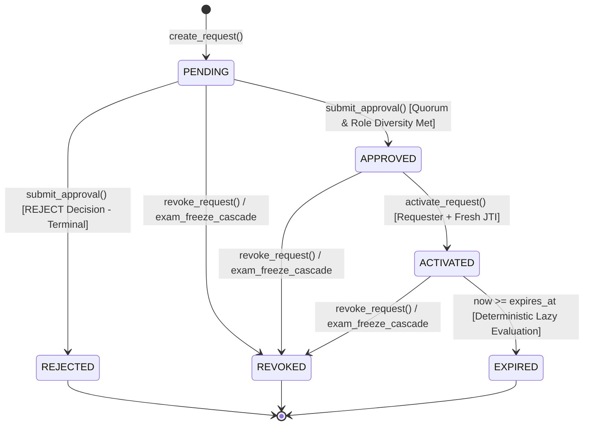

# B-SEA Phase 3B: Break-Glass & Controlled Complete-Paper Exception

## 1. Architecture Overview

Phase 3B of the Bharat Secure Examination Architecture (B-SEA) defines and implements the **Break-Glass & Controlled Complete-Paper Exception** mechanism. In normal examination operations (governed by Phase 2 Question Sharding and Phase 3A Ephemeral Authorization), questions are strictly compartmentalized and access is restricted to assigned individual shards. However, operational emergencies (such as verified printing/embossing defects, center-level technical failure, or court-mandated audits) may necessitate assembling the complete examination paper under emergency oversight.

Phase 3B provides this capability without compromising the underlying security invariants of B-SEA. It introduces:
1. **Multi-Party Quorum with Enforced Role Diversity**: Requires simultaneous cryptographic approval across distinct authority classes.
2. **Separation of Duties**: Requesters are strictly prohibited from approving their own break-glass requests.
3. **Deterministic Canonical Fingerprinting**: SHA-256 parameter digest binds all request terms; any tampering invalidates all prior approval votes.
4. **Fresh-Session JTI Activation**: Request creation binds to user identity; activation binds exclusively to a fresh JWT JTI session to eliminate session-expiry deadlocks during quorum collection.
5. **Server-Side No-Persistent-Plaintext Invariant**: Plaintext paper questions are assembled strictly in process memory and never written to PostgreSQL, Redis, local disk, object storage, or audit logs.
6. **Strict Answer-Key Isolation**: The complete-paper endpoint does not query `AnswerKey` or return any evaluation data, scoring logic, or correct options.
7. **Attribution-Oriented Dynamic Watermarking**: In-memory assembled papers include dynamic watermark metadata (requester username, user ID, request ID, session JTI, and UTC timestamps).
8. **Application-Level Transactional Cascade**: Exam freeze or cancellation cascades through active break-glass requests, immediately invalidating approvals and halting access.

---

## 2. State Machine & Lifecycle

The lifecycle of a `BreakGlassRequest` follows a strict deterministic state machine:



### State Definitions
- **`PENDING`**: Request submitted and bound to requester identity and canonical content fingerprint. Awaiting required quorum and role diversity.
- **`APPROVED`**: Headcount quorum and minimum distinct role diversity satisfied by eligible approvers. Awaiting requester activation.
- **`ACTIVATED`**: Requester activated request with a fresh authenticated JWT session. Countdown timer active.
- **`EXPIRED`**: Configured validity duration elapsed. Server-side access denied deterministically.
- **`REVOKED`**: Explicitly revoked by authorized personnel or automatically revoked via exam freeze/cancellation cascade.
- **`REJECTED`**: Terminally rejected by any eligible approver. Permanent final state.

---

## 3. Quorum & Role Diversity Enforcement

Database uniqueness constraints alone (`Unique(request_id, approver_id)`) prevent duplicate votes from the same user account, but cannot enforce diversity of authority. Phase 3B enforces **Role Diversity** server-side inside locked transactions (`SELECT ... FOR UPDATE`):

### Quorum Policy Configuration (`BreakGlassPolicy`)
- `required_quorum`: Minimum number of valid approval votes (default: 2).
- `min_distinct_authority_classes`: Minimum number of distinct user roles among valid approvals (default: 2).
- `eligible_requester_roles`: `[SUPER_ADMIN, EXAM_AUTHORITY]`.
- `eligible_approver_roles`: `[SUPER_ADMIN, EXAM_AUTHORITY, SECURITY_OFFICER, RELEASE_AUTHORITY]`.
- `minimum_duration_minutes`: 10 minutes.
- `maximum_duration_minutes`: 60 minutes.
- `default_duration_minutes`: 30 minutes.

### Evaluation Algorithm
```python
valid_approvals = [a for a in request.approvals if a.is_valid and a.decision == APPROVE]
distinct_roles = {a.approver_role for a in valid_approvals}

headcount_met = len(valid_approvals) >= request.required_quorum
diversity_met = len(distinct_roles) >= request.min_distinct_roles

if headcount_met and diversity_met:
    request.status = BreakGlassRequestStatus.APPROVED
```

### Terminal Rejection Rule
A single `REJECT` decision submitted by an eligible approver immediately transitions the request to terminal `REJECTED`, invalidates all prior approvals, and prevents any future transition to `APPROVED`.

---

## 4. Canonical Fingerprint Generation

To guarantee tamper-resistance against material alteration of request terms (such as changing the exam ID, blueprint version, or requested duration), a deterministic canonical representation is generated and SHA-256 hashed at creation:

```json
{
  "blueprint_hash": "...",
  "blueprint_id": "...",
  "exam_id": "...",
  "exam_version": 1,
  "form_label": null,
  "incident_id": "INC-2026-001",
  "min_distinct_authority_classes": 2,
  "policy_version": "1.0",
  "requested_duration": 30,
  "requester_id": "...",
  "required_quorum": 2,
  "scope": "COMPLETE_EXAM_PAPER"
}
```

Approvals record a snapshot of `request_fingerprint`. Before recording an approval or evaluating quorum, the fingerprint is recalculated. Any discrepancy invalidates prior approvals and rejects the operation with HTTP 400.

---

## 5. Session Activation Model

Unlike standard OAuth flows that immediately bind to the current JWT at request creation, Phase 3B separates request identity from session binding:
1. **Creation**: Binds to `requester_id` (User ID). This allows the requester to collect approvals over time without risk of session-expiry deadlocks.
2. **Activation**: Permitted only when status is `APPROVED` and `actor.id == requester_id`. The requester must present a fresh authenticated session. The request binds `activation_session_id = current_jwt_jti`, sets `activated_at = utcnow()`, and computes `expires_at = activated_at + requested_duration`.
3. **Access**: Every subsequent read of the assembled paper verifies that the caller's JWT `jti` matches `activation_session_id`. Stolen or replays from other sessions are blocked with HTTP 403.

---

## 6. Server-Side No-Persistent-Plaintext Invariant & Answer-Key Isolation

### Assembly Pipeline
```
Encrypted Question in PostgreSQL
           │
           ▼
Verify Exam Status & Blueprint Integrity
           │
           ▼
Decrypt in Process Memory via KMSInterface / MockKMS
           │
           ▼
Strip Evaluation Metadata (correct_option, explanation)
           │
           ▼
Inject Attribution-Oriented Watermark Metadata
           │
           ▼
Deliver Ephemeral JSON to Authenticated Requester
```

### Security Boundary Guarantees
- **No Master PDF**: No PDF or composite document is generated or stored on disk.
- **No Database Persistence**: Plaintext question text is never written to PostgreSQL tables.
- **No Cache Persistence**: Redis or memcached are not used for assembled paper storage.
- **Zero Evaluation Data**: `AnswerKey` table is never queried. The complete-paper assembly service selects only from the `Question` table.
- **Server-Side Scope**: "Server-Side No-Persistent-Plaintext Invariant" explicitly governs the server boundary. Client/browser cache and display characteristics are subject to browser runtime behavior.

---

## 7. Attribution-Oriented Dynamic Watermarking

Every successful assembly response includes an attribution watermark payload:
- `requester_username`: Username of the authorized requester.
- `requester_user_id`: UUID of the requester.
- `request_id`: Break-glass request UUID.
- `activation_session_id`: JWT JTI of the active session.
- `assembled_at_utc`: UTC timestamp of assembly.
- `expires_at_utc`: UTC expiration timestamp.
- `audit_ip_hash`: SHA-256 hash of client IP (supplementary audit metadata only; not used for identity or authorization).
- `security_notice`: Forensic attribution statement.

The frontend Operations Center renders this watermark as an active banner and a low-opacity diagonal background overlay across all inspected questions.

---

## 8. Expiration & Transactional Revocation

### Deterministic Lazy Expiration
Expiration does not rely on frontend timers or background cron jobs. On every access attempt (`GET /assembled-paper`, `GET /requests/{id}`, or `GET /requests`), if `now >= request.expires_at`, the request is lazily transitioned to `EXPIRED`, committed to the database, audited, and access is rejected with HTTP 403.

### Transactional Cascades
When an exam is frozen or cancelled (e.g. via `POST /api/v1/release/{id}/freeze` or `POST /api/v1/exams/{id}/cancel`):
1. An application-level transaction locks the exam row with `SELECT ... FOR UPDATE`.
2. All `PENDING`, `APPROVED`, and `ACTIVATED` break-glass requests for that exam are locked.
3. Status transitions to `REVOKED` with `revocation_reason = "Exam freeze/cancellation cascade"`.
4. All associated approvals are invalidated (`is_valid = False`).
5. Tamper-evident `BREAK_GLASS_REVOKED` audit events are written.

---

## 9. Audit Event Matrix

Phase 3B emits hash-chained audit events for all security lifecycle transitions:

| Event Type | Actor | Trigger | Resource Type |
| :--- | :--- | :--- | :--- |
| `BREAK_GLASS_REQUESTED` | Requester | Request creation | `break_glass_request` |
| `BREAK_GLASS_APPROVAL_SUBMITTED` | Approver | Approval vote cast | `break_glass_request` |
| `BREAK_GLASS_QUORUM_ACHIEVED` | Approver | Quorum & role diversity met | `break_glass_request` |
| `BREAK_GLASS_REJECTED` | Approver | Rejection submitted | `break_glass_request` |
| `BREAK_GLASS_ACTIVATED` | Requester | Session activated | `break_glass_request` |
| `BREAK_GLASS_PAPER_ASSEMBLED` | Requester | Assembled paper read (per-access) | `exam` |
| `BREAK_GLASS_EXPIRED` | System / Requester | Lazy or explicit expiration | `break_glass_request` |
| `BREAK_GLASS_REVOKED` | Admin / System | Explicit revocation or cascade | `break_glass_request` |
| `BREAK_GLASS_ACCESS_DENIED` | Actor | Unauthorized attempt | `break_glass_request` / `exam` |

Sensitive data (passwords, JWTs, KMS private keys, plaintext questions, and answer keys) are strictly excluded from all audit metadata payloads.

---

## 10. Threat Model & Defenses

| Threat | Attack Vector | B-SEA Phase 3B Defense |
| :--- | :--- | :--- |
| **Requester Self-Approval** | Requester votes to approve own request | Explicit separation of duties check (`approver.id != request.requester_id`) rejected with HTTP 403. |
| **Collusion / Homogeneous Quorum** | Two officers of the same role attempt to approve | Role diversity enforcement requires $\ge 2$ distinct role classes inside locked transaction. |
| **Approval Replay / Duplicate Vote** | Approver submits multiple votes | `UniqueConstraint(request_id, approver_id)` + locked transaction check returns HTTP 409. |
| **Parameter Tampering** | Changing exam version or duration post-creation | Deterministic SHA-256 canonical fingerprint mismatch check invalidates approvals with HTTP 400. |
| **Session Theft / Token Replay** | Attacker uses request ID from another session | Ephemeral access revalidates token `jti == activation_session_id`. Discrepancies rejected with HTTP 403. |
| **Stale / Expired Access** | Reading paper after countdown finishes | Deterministic lazy server-side expiration rejects with HTTP 403 and commits `EXPIRED`. |
| **Compromised Exam Access** | Reading paper during center security breach | Transactional freeze cascade revokes all active break-glass requests and approvals. |
| **Answer-Key Exfiltration** | Using break-glass to obtain scoring keys | Strict isolation: `AnswerKey` table is never queried; evaluation data stripped in memory. |

---

## 11. Security Test Suite Summary

The Phase 3B test suite (`backend/tests/security/test_break_glass_authorization.py`) validates 30 security properties:

1. Request creation with valid parameters.
2. Separation of duties: requester cannot approve own request.
3. Duplicate approver rejected with HTTP 409.
4. Unauthorized approver role rejected with HTTP 403.
5. Quorum satisfaction strictly requires role diversity.
6. Activation requires `APPROVED` status.
7. Non-requester cannot activate approved request.
8. Fresh session JTI bound during activation.
9. Cross-session replay blocked via JTI validation.
10. Request ID alone insufficient for authorization.
11. Assembled paper completely excludes answer keys.
12. Deterministic lazy expiration transitions status to `EXPIRED`.
13. Explicit revocation immediately halts paper assembly.
14. Exam freeze transactional cascade revokes break-glass requests.
15. Material fingerprint mismatch invalidates approvals.
16. Rejection permanently transitions request to terminal `REJECTED`.
17. Concurrent approval submissions serialized via row locking.
18. Tamper-evident hash-chained audit logging across lifecycle.
19. Repeated paper reads audited independently per read.
20. Server-Side No-Persistent-Plaintext Invariant verified against PostgreSQL storage.
21. Cross-exam request IDOR rejected with HTTP 404.
22. Cross-blueprint version replay blocked.
23. Competing approval race across distinct roles reaches quorum safely.
24. Requester attempting multiple approval identities blocked.
25. Approval attempts after terminal rejection rejected with HTTP 409.
26. Approval attempts after expiration rejected with HTTP 409.
27. Activation attempts after revocation rejected with HTTP 403.
28. Access attempts after exam cancellation rejected with HTTP 403.
29. Duration policy violation rejected with HTTP 400.
30. Scope policy violation rejected with HTTP 400.

---

## 12. Prototype Limitations & Production Boundary

### Prototype Boundaries
- **Cryptographic Engine**: The prototype uses `MockKMS` simulating AES-256-GCM and Ed25519 signing. Production deployments must bind to a certified FIPS 140-3 Level 3 / Level 4 Hardware Security Module (HSM) or dedicated cloud KMS.
- **Client Runtime**: Watermarking provides forensic attribution. It does not prevent external analog optical recording (e.g. handheld camera or monitor capture).
- **Zero-Disk Scope**: The "Server-Side No-Persistent-Plaintext Invariant" strictly guarantees that the server tier never persists plaintext to PostgreSQL, Redis, disk, or logs. It makes no claims regarding operating system paging, RAM caching, or browser DOM memory on client devices.
- **Scale**: Multi-instance deployments require pgBouncer or connection pooling configured to accommodate `SELECT ... FOR UPDATE` row locks under high concurrency.
